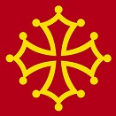

**<h1 align="center">The Cathar Trail</h1>**

<h1 align="left">The Cathar Crest</h1>

# Overview
This is the second Milestone Project within the Code Institues Full Stack Web Development programme which will create
a fully responsive, interactive website available across all devices and will focus on the Languedoc region in the 
South of France.  The objective of the website is to raise awareness of the tranquility of the region and to encourage 
the public to broaden their travel experience and learn how the Cathars lived in this forgotten part of the world.

## Table of Contents:
* [User Stories](#user-stories)
* [User Experience](#user-experience)
    *  [The Strategy](#the-strategy)
    *  [The Scope](#the-scope)
    *  [The Structure](#the-structure)
    *  [The Skeleton](#the-skeleton)
    *  [The Surface](#the-surface)

*   **User Stories**
    *   **First Time Visitor**
*   "I want to be able to learn more about the surrounding countryside and what the trip will offer in terms of an experience"       
*   "I lead a busy life and would like to navigate my way around the site with ease to see what is on offer in the surrounding region"
*   "I always take note of testamonials from other users on all sites, so I would like to access the social media content and browse
the site for feedback left by other travellers"
*   "I would like the opportunity to get in touch with the administrators to answer any questions I have before I make my booking"
*   "Can I sign up to publications to be kept informed of any updates or changes to packages on offer"

    *   **Returning Visitor**
*   "When I was planning my annual holiday earlier this year, I found the site very easy to navigate and details were available which made
planning so much easier"
*   "I saw on their social media links that there was a sale on for Summer breaks - I'm here to find more details and to book something now
for my annual trip"
*   "I have one or two questions still to address before I make my final booking and would like to submit a request for further details"

    *   **Frequent User**
*   "In my busy lifestyle, I don't have time to browse as often as I like so I would like to sign up for a newsletter so that I don't miss
any offers or updates on upcoming trips"
*   "I find the links to the social media content easily accessible on the site and enjoy reading comments left by travellers who have recently
enjoyed the Cathar Experience"

#   User Experience (UX)

###    1. The Strategy

*   The site has been developed to allow users to come, research, plan and purchase a trip with a difference.
*   It's aim is to provide a cultural experience in a region of France away from tourists in other popular areas of the country
and is suited to all age groups.
*   Due to the location of the castles away from the more conventional and popular resorts it will provide good value for money and 
an opportunity for visitors to experience something they will never forget.
*   The site provides details on a selection of five of the 12 Cathar Castles in the region and allows visitors to make informed decisions
about where they would like to go.
*   The site with be designed in accordance with the mobile first principles of coding which will also include interactive maps for each
castle location and surrounding area.
*   The contact form will allow the user to make enquiries and sign up to our database of users for travel literature and updates.

### 2. The Scope

*   The objective of the site is to build a concise and informative platform which will allow users to make well informed decisions about
whether they wish to travel to this region of France for a holiday with a difference.
*   I will be constructing the website using the HTML, CSS and bootstrap knowledge I have acquired and to incorporate new skills and knowledge
relating to JavaScript and the use of APIs.
*   It is intended the layout will be well spaced out with a good blend of text, imagery and maps to encourage the user to make plans that
will suit their budget, fitness and enthusiasm.
*   There will be the opportunity for the user to browse the social media links in order to review feedback from previous travellers and to 
join forums to allow them to ask questions to meet their concerns about the trip.

### 3. The Structure

*   The layout of the site will be consistent with the message the owner is trying to convey, that is, they would like to encourage people
to travel off the beaten track to try something different for their holiday.
*   The users will find that the site will be predicatable, as in, they will be able to follow the content from one page to the other with ease
and it will provide clear and intuitive feedback for what the user is looking for.

### 4. The Skeleton

*   This area will develop the content of The Structure a little further, the user will experience immediate value with links, imagery and 
maps laid out across the site.
*   The user will be leaving the site with a sense of positivity and curiousity of what could be the trip of a lifetime.
*   There will be progressive disclosure reflected across the site which will educate the user and provide subtle enhanced experience as they
navigate through the pages and the website.

### 5. The Surface Plane
##### 1.Colour Scheme

I decided to select three colours which I felt enhanced the imagery and content of the site in order to convey a tone of scerenity for the user
and which gives a subtle contrast to the other imagery on the site.

The colours used on the Cathar Trail website were:

* F5F5DC - Beige - For background colours
* A1A1A1 - Grey - For the Navbar to work with the structure of the castles
* 800404 - Maroon - For the footer to draw the users attention to further details on the social media links.

##### 2.Typography
* The font selected for the website was 'Bitter' with a fallback of 'Lato'.  I felt that this font brought formality to the site and gave
the user confidence that what they saw and read.

##### 3. Images

The careful selection of images used was crucial so that the users attention to the dramatic settings of each of the individual castles. This
is critical as the mountain top location of each of the castles is the unique selling point of this holiday and experience for the user.

##### 4. Maps & Videos

The introduction of the video is to give the user an interactive experience with each of the castles outlined in this experience.  Although there 
are over a dozen castles in the "Cathar country" a selection of five of the most scenic castles were selected for this project.

##### 5. Wireframe

Wireframes for this project were composed using Balsamiq. I had originally included a background image of a French flag to set as wallpaper
for the site, and drop the opacity to 25%, however, I felt that this particular use of imagery wasn't best applied here as it distracted the 
user from the other content of the site and it was removed.

[Wireframes](https://github.com/colinflahive/MS2-TheCatharTrail/blob/master/assets/docs/Wireframes.pdf)

### Technologies Used

*   HTML5
*   CSS3
*   Bootstrap 4
*   JavaScript

### Frameworks | Libraries | Programs Used

*   Balsamiq
    + Balsamiq software was used to to get an outline of the website I was looking to draft.  During the process it was referred to on 
    a number of occasions for reference to reflect what was going in to the project.  Unfortunately due to time constraints I was unable
    to complete the Castles page to my satisfaction and had to omit the image of the castle and the brief history of each location.

*   GitHub    
    + GitHub was the preferred Integrated Development Environment (IDE) for this project was used used to store my code each
    time it there was a Git performed. 

    + Git was used for version control for this project when using GitHub Gitpod terminal to commit to Git and Push to GitHub. Clear 
    and concise descriptions were included at the Git Commit instruction in order for the user to identify what changes and amendments were
    made to the code in between Push instructions.

*   EmailJS
    + was tested and used to submit emails from the site to my Gmail account for travel queries.

*   Bootstrap
    + This was used to create the basic HTML content and structure together with Bootstrap CSS for the layout of the site.

*   Google Fonts Library
    + The "Bitter" font was used for the majority of the content of the site with "Lato" used to give a more discreet, refined look to the 
    cards for the recommendations.

*   Font Awesome
    + This site was used for the icons for the Footer on each page of the site and for the social media icons on the recommendation cards.

*   YouTube
    + Used to source the video on the Experience page outlining the countryside and surrounding area of the Cathar Castles.

*   Google Images
    + Used to source the images for the carousel and the recommendation cards from Pinterest, Tripadvisor and Credit for Hotel de la Cite Carcassonne 
    on Card is abacapress/philippe louzon.

*   Toolur
    + Used to resize the images for the site.

###  Resouces

*   W3schools
*   Slack
*   YouTube
*   Stack Overflow
*   Code Institute Love Running Walk Through Project for the inspiration for the fade image with text on the homepage

#   Credits

*   Allen Thomas Varghese my mentor who provided invaluable feedback, expertise, direction and knowledge throughout the project. 
*   The Tutor Support Team at the Code Institute who were on hand to deal with a number of issues that arose through the completion
    of this project.  Their assistance gave me renewed impetus to keep going to see the project through.
*   The Slack community, especially in the closing period towards my deadline due date.  There were some students on there who made a huge
    difference.

