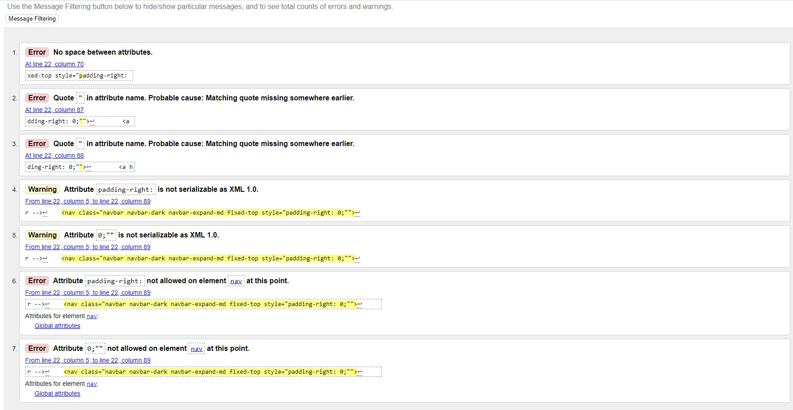
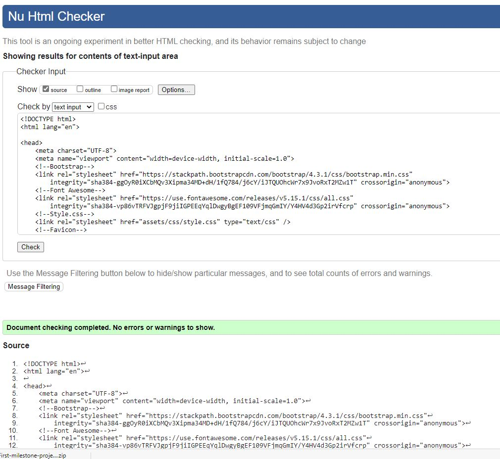
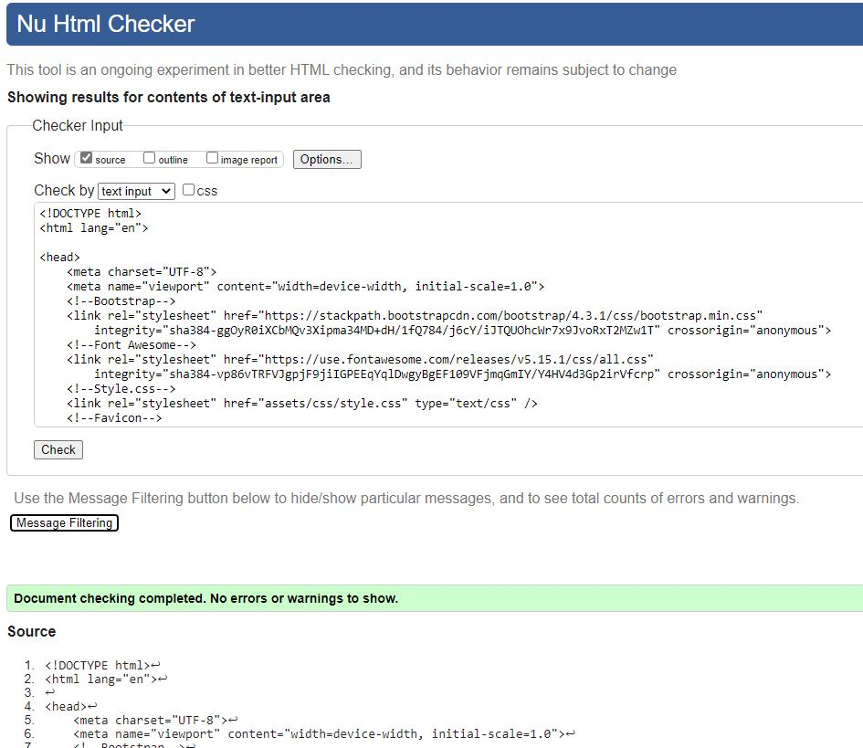
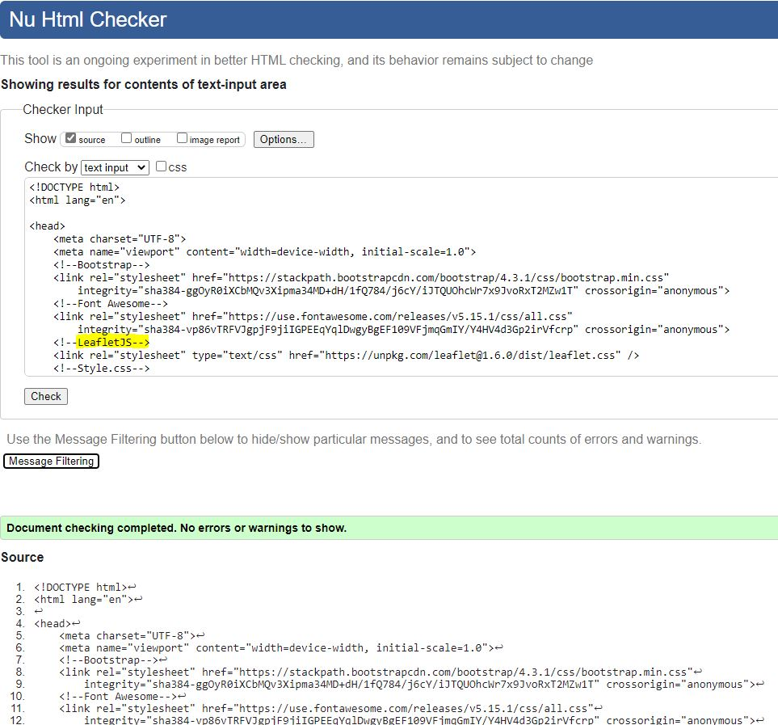
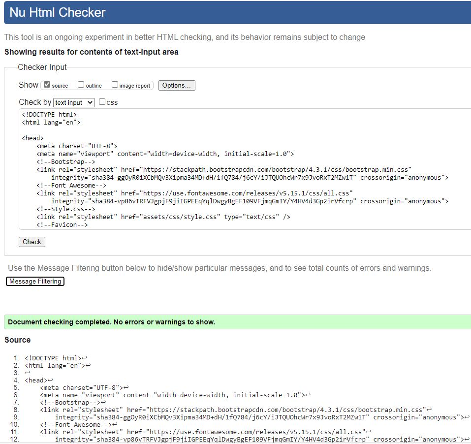
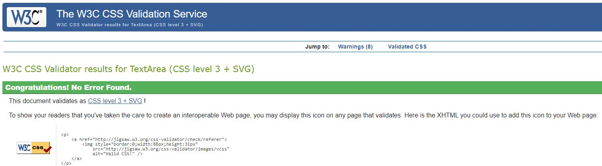
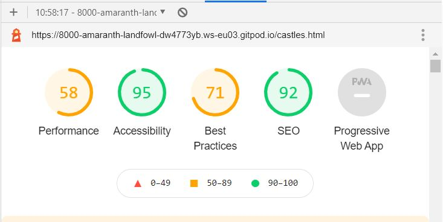
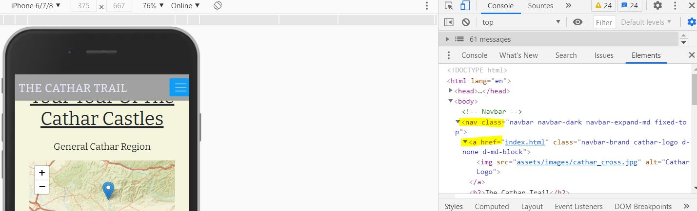

# 
Testing Results for [The Cathar Trail](https://karzuin.github.io/First-milestone-project/)

Below are the testing requirements for The Cathar Trail website.

* The 'direct input' field on the [W3C HTML Validator](https://validator.w3.org/#validate_by_input) website was used to validate the html code.
All files passed with the exception of the index.html file which showed the following error.

#### index.html

#### experience.html
No errors, no warnings reported:

#### castles.html
No errors, no warnings reported:

#### contact.html
No errors, no warnings reported:

* CSS was inserted in to the 'direct input' field on the W3C CSS Validation Service website [Jigsaw](https://jigsaw.w3.org/css-validator/#validate_by_input)
revealed no errors either.

#### Style.css:
No errors, no warnings reported:

---

#### Header Section

The Header section is set to 'fixed-top' so that the user does not lose sight of the menu and by clicking on the logo in the top
left corner, it returns the user back to the homepage.  All links to the individual pages were tested and each page opened as 
expected when clicked.

#### Index file

The zoom effect set in CSS responded as expected when the page loaded on the browser and on variod devices. When the page is reloaded
in the browser, the zoom effect responds accordingly.

#### Experience file

The slideshow at the top of the page loads correctly when the page launches. The display responds and loads on interval as expected 
which was taken from [Bootstrap Carousel](https://getbootstrap.com/docs/4.3/components/carousel/).  Additionally it reacts responsively
when loaded on other devices and terminals without any impact on the images.

The use of the video was to give the users a more visual experience of what the region has to offer the visitors.  Playback and display
responds as expected without any significant delays on loading time across the devices and browsers it was tested on.

At the end of the section on History, the link embedded in to the code directing users to the local tourism website launches in a separate 
window so that users are not redirected away from the website they are using. There are no issues or concerns with the browser opening the 
link and users should be able to investigate more detail about the region from what the local tourism website has to offer.

The cards displayed at the bottom of the page highlight the top hotel, restaurant and activity within the region with the image highlighting
the venue.  The cards flip on all devices without any issues and the images display clearly. There were no issues with the social media icons
not opening, when the user clicks on each of the icons it brings the user to the homepage of each of the social media applications so that the
user can read any feedback received.

#### Castles file

The page focuses solely on the location of the castles in the region.  There are over 12 castles in total on the Cathar Trail, however, this 
website only focuses on a select few. The user is able to click on each of the markers on each map which will highlight the name and location 
of each of the restaurants, castles, hotels and activities.  The maps seem to render as required and markers and contents of the markers are 
visible on all devices.

#### Contact file

When the page renders, the information to the user displays as desired, on completion of the contact form/submission of the email the form resets
to a blank template.  Submission of a query was tested on iPhone X & iPhone 5/SE on Google Developer Tools and form submitted as expected.

#### Footer Section

All social media icons are linked to their respective sites and open on a separate page for the user for ease of use and navigation so that they don't 
lose the place where they are on the site0.  It was tested across all the devices each opened as expected. Additionally, as stated the social media icons
on each of the cards on the Experience page all opened on the respective sites accordingly.

---

### Browser Test

|      Browser      | Responsive | Links/URL's | Media | Renders |
|:-----------------:|:----------:|-------------|:-----:|---------|
|   Google Chrome   |    Good    |     Good    |  Good |   Good  |
|      Firefox      |    Good    |     Good    |  Good |   Good  |
|       Opera       |    Good    |     Good    |  Good |   Good  |
|       Safari      |    Good    |     Good    |  Good |   Good  |
|        Edge       |    Good    |     Good    |  Good |   Good  |

### Device Test

|    Device    | Responsive | Links/URL's | Media | Renders |
|:------------:|:----------:|-------------|:-----:|---------|
|   Galaxy S5  |    Good    |     Good    |  Good |   Good  |
|    Pixel 2   |    Good    |     Good    |  Good |   Good  |
|  iPhone 5/SE |    Good    |     Good    |  Good |   Good  |
| iPhone 6/7/8 |    Good    |     Good    |  Good |   Good  |
|   iPhone X   |    Good    |     Good    |  Good |   Good  |
|     iPad     |    Good    |     Good    |  Good |   Good  |
|   iPad Pro   |    Good    |     Good    |  Good |   Good  |
|  Surface Duo |    Good    |     Good    |  Good |   Good  |

###  Developer Tools Lighthouse

Feedback on the "Performance" criteria were broadly directed at the size of the images used on the site.  The comments and feedback 
provided by the facility in Developer Tools has been noted and will be followed in future projects.  Due to time constraints I was 
unable to make any adjustments to the size of the files at this point or else the delivery deadline would have been missed.

### User Stories / Client Goals Test

User stories were tested by myself, friends and family.

#### User Stories

- As a user, I'm looking for more information about the history of the region and it's offerings.

    *   The history of the region and background to the Cathar population living in this areas 800-900 years ago gives
    the user a brief background as to how the people lived in that era.

- As a user, I am for a compact and concise website with easy navigation in order to minimise the user
experiencing any confusion.

    *   The homepage is designed to provide a striking image for the user along with testamony from previous visitors
to give an indication of the quality of the occasion.

- As a user, the website should be available on a variety of desktop, mobile and tablet devices.

    *   Potential users should be able to browse with Chrome, Safari, Firefox and Microsoft Edge with full responsiveness.

- As a user, I want to find out more about Cathar castles and the region.

    *   On the Experience page, it will outline what is on offer for the user. Beginning with a carousel/slideshow, it will
provide the user with five of the castles on offer and the surrounding countryside. There is also a video highlighting the 
5 castles the visitors can avail of on their tour, along with an illustrative map of the locations of the 5 castles.  Lastly,
there are three cards displayed at the bottom of the page which highlights the three main attractions visitors can take advantage
of while they are in the area.

- As a user, I need more detail about locations of the attractions.

    *   On the Castles page, the first map gives the user an overview of where each of the castles
    are located.  Following on after that, there is a map dedicated to each individual venue and also
    includes the location of other facilities if the visitor wishes to stay in the area any longer.

- As a user, I would like to contact the Cathar Trail to enquire about further details.

    *   On the Contact page, the user can submit a query to the website which will land in the inbox
    of the sites mailbox.  The user also has the option to sign up to newsletters now, or at a later
    time.
---

## Unresolved Bugs:

* Since my (fail) grade was given and I worked to make the changes requested to improve the appearance of the website
there has been an ongoing issue with one particular html "class" which I have not been able to resolve.  I have put the question
up on Slack which went unanswered and I had two conversations with the Tutor Support Team and I was still unable to resolve the matter
to the satisfaction of myself and possibly the marker.

On the index.html file on developer tools, there is an ".active" class that appears in the navbar tag which is having an 
impact on a number of other aspects of the site.  The ".active" class is not physically typed in to the code in the project,
so it appears to be a (pseudo) class from Bootstrap.  It is does not appear on any of the other pages navbar code on developer
tools and causes no other problems. As a result, I am unable to target the navbar-brand and cathar-logo classes on the 
index.html file, which means that the logo does not appear on the homepage when the page is rendered.  Additionally, I have the 
class ".fixed-top" included in the <nav> tag and also I believe as a result of this '.active' class I am unable to execute that 
class either.  When I remove the "position: relative;" from the CSS file, the navbar does fixed-top, however, when the user scrolls the
navbar slides up the screen slightly on mobile display and the position of the toggler moves, so I have had to leave the 
"position: relative" included in the style.css file.

* During final testing, two of my testors tested the website on the iPhone 11 handset which is not reflected in Google Developer tools.
Due to time constraints for resubmission, I did not have time to investigate what the remedy is for the issues this handset highlighted.
When the user flipped the card on the Experience page, the text of "The Hotel", "The Restaurant" and "The Activity flipped and displayed 
backwards.  This did not come to my attention when I was testing the website on all other devices on dev tools where this issue did not 
occur.  I will raise this with my peers to seek advice as to what is expected for this issue for my forthcoming projects.

